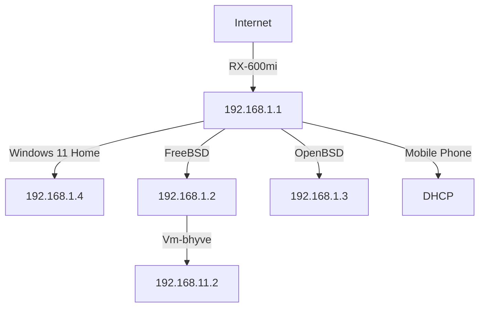
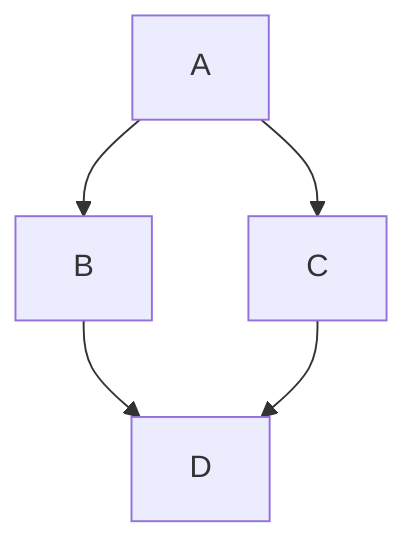

## Profile

|Name|Sex|Height|Weight|Blood type|
|---|---|---|---|---|
|masayoshi|Male|174.0cm|53.0kg|B+|

## Computers

Here is a simple flow chart:

## Interests

### Listening English

I would like to record NHK Radio RADIRU*RADIRU to improve my English.
I have written a simple programme [Radio.pl](https://github.com/m-fujimoto/Radio) in Perl.
 
